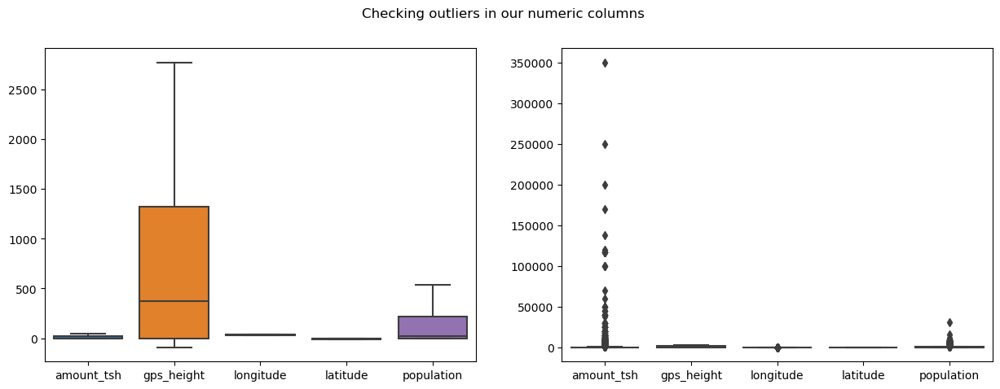
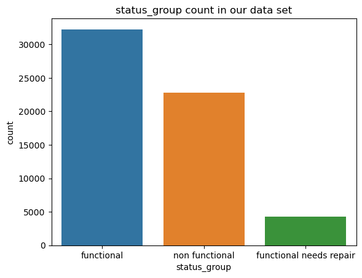
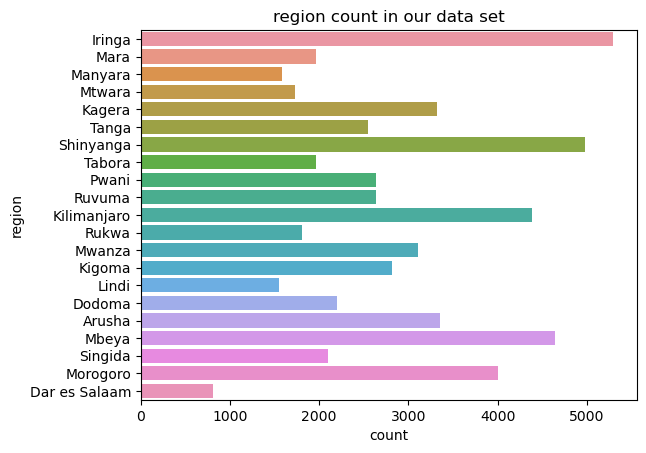
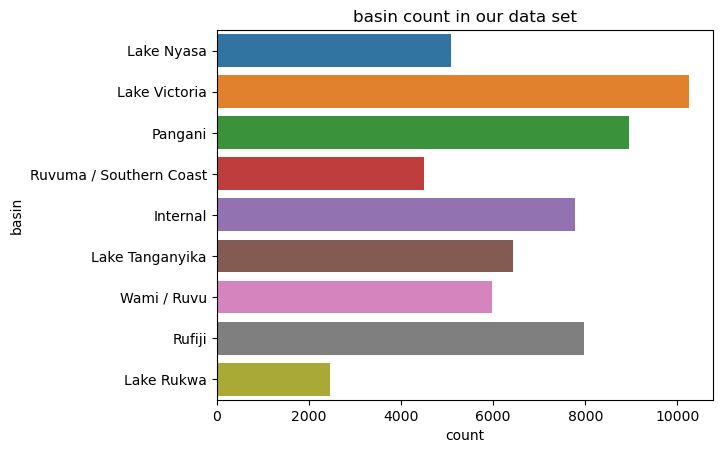
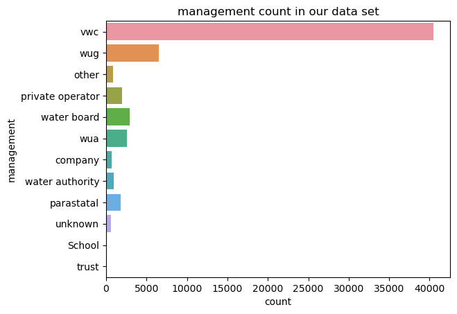
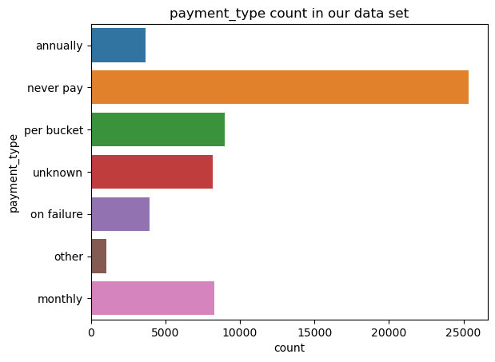

## TITLE: TANZANIA WATER WELL PUMP STATUS PREDICTION
### OVERVIEW
In Tanzania, the history of water supply has been a dynamic interplay of geographical, social, and economic factors. Initially blessed with abundant water resources, the country encountered challenges in distributing water efficiently. To address this, a proactive initiative has emerged. By analyzing historical data on pump functionality, geography, maintenance, and local demographics, this project aims to predict potential pump issues. Its goal is to create a scalable predictive tool aiding decision-makers. This tool not only optimizes resource allocation and maintenance but also engages communities. Through partnerships and qualitative data integration, it seeks to blend data-driven insights with community perspectives. Ultimately, this holistic approach aims to improve water infrastructure management sustainably while fostering community empowerment in Tanzania.

In Tanzania, water supply history intertwines geography, society, and economics. Despite abundant resources, efficient distribution posed challenges. Addressing this, a project analyzes pump data to predict issues, aiding decision-makers in resource allocation and maintenance. Beyond predictive analytics, it prioritizes community engagement, integrating qualitative data for a holistic, participatory approach to sustainable water infrastructure management.
## Challenges
In a developing country like Tanzania, ensuring clean and accessible piped water faces numerous challenges. Some of these challenges include:
1.`Infrastructure Deficiency`: Many areas lack the necessary infrastructure for piped water systems. Remote or rural areas might not have pipelines or water treatment facilities, making it difficult to distribute clean water to these regions.

2.`Limited Access to Technology`: Developing countries may face limitations in accessing advanced technology for water treatment and distribution.

3.`Financial Constraints`: Funding constraints often limit the government's ability to invest in water infrastructure and maintenance.

4.`Population Growth`: Rapid population growth strains existing water resources and infrastructure. As urbanization increases, the demand for water rises, putting pressure on already limited water sources and distribution systems.

5 `Poor Maintenance`: Existing water infrastructure might suffer from poor maintenance due to a lack of resources or skilled personnel.
## Proposed solutions
1.Build a predictive machine learning model that predicts whether a pump is functional , not functional or functioning but needs repair in orde to reduce water shortage due to failure of pumps

2.Identify features or properties that lead to these water related problems and adress them

3.Identify regions that suffer most from these challenges so we can have a map or ways on how to improve their status.

4.Investigate whether the infrastructure available is enough to meet the people's need 
### PROBLEM STATEMENT
The provision of clean and sustainable water access remains a critical challenge in Tanzania, with a vast network of water pumps serving communities across the country. However, the operational status of these pumps fluctuates, leading to intermittent water supply and hindering communities' access to safe drinking water. This project addresses the pressing need to develop a robust machine learning classification model capable of accurately predicting the operational status of water pumps in Tanzania.

The project scope focuses on harnessing historical data encompassing pump functionality, geographical features, maintenance records, and regional demographics to train and validate a predictive model. The objective is to accurately classify water pumps into different status categories, including 'functional,' 'functional needs repair,' and 'non-functional.' A successful model will enable stakeholders and decision-makers to anticipate potential pump failures or maintenance requirements proactively, thus optimizing resource allocation, reducing downtime, and ensuring sustained water access for Tanzanian communities.
# GOALS AND OBJECTIVE
General objective;
The main objective is to build and train a machine learning model to help us predict if water pumps installed in water points are functioning, not functional or working but needs repair.
Specific objectives

Use exploratory analysis to visually understand and understand what the data is communicating and also try to understand relationship between our data columns
# DATA UNDERSTANDING AND ANALYSIS
Data understanding involves comprehending the dataset's structure, contents, and potential insights, examining features and their relationships to extract valuable information for analysis or modeling purposes.

-`Source` - The dataset originates from Taarifa, a platform collecting reports on infrastructure and services, particularly focused on water points. This data was compiled by GeoData company limited.

-`Components`- This dataset consists of 59400 rows and 41 columns of data.
# DATA PREPARATION
There we many columns that had similar data or almost related data so I studied them one by one and dropped those seemd irrelevant or duplicates to other columns

I also deal with missing values where i used an imputer to fill the values. Since it was categorical I imputed with the most frequent one(mode)

There were a few outliers and I was able to sort that using the interquartile range clipping.The plot below shows behavior after clipping(left plot) and before clipping(right_plot)

### Our status_group(Target class)
Our target group has three classes and below is their distribution

### Univariate exploratory analysis
#### Region
The following are the regions under study or from where our problem data was collected

#### Water basins in Tanzania
The water basins geographically located in Tanzania are nine in total. Lake Victoria is the largest in terms of body mass and Lake Rukwa holds the last position

#### Management groups
The management columns tells us about the people incharge of running the water wells located in Tanzania. Most water wells in Tanzania are managed by the Village Water Community(VWC). This makes a lot of sense sinse Tanzania is a communist country. School and trust hold the least share for the water well management.
The abbreviations of the values are explained here;
  1. VWC - Village Water Community 
  2. WUG - Water User Group
  3. WUA - Water User Association
Both WUG and WUA are mainly involved in activities such as irrigation, maintaining water infrastructure, resolving issues related to water usage among other things

#### Payment methods
The means of payment for water in Tanzania has seven unique modes of payment. Most of the water wells are free and no charges are needed to access water. This is what the plot says as we can see most common mode of payment is "never pay". Our other plots on management concur with this as we can see most water wells are managed by the village community

#### Water quality
In terms of water quality, Tanzania is blessed with soft water. Soft water generally contains low concentrations of minerals like calcium and magnesium, leading to fewer issues related to limescale buildup in pipes and appliances. In Tanzania, having soft water can contribute to reduced instances of scale accumulation in plumbing systems and appliances, potentially minimizing maintenance and extending the lifespan of water-related infrastructure. 

